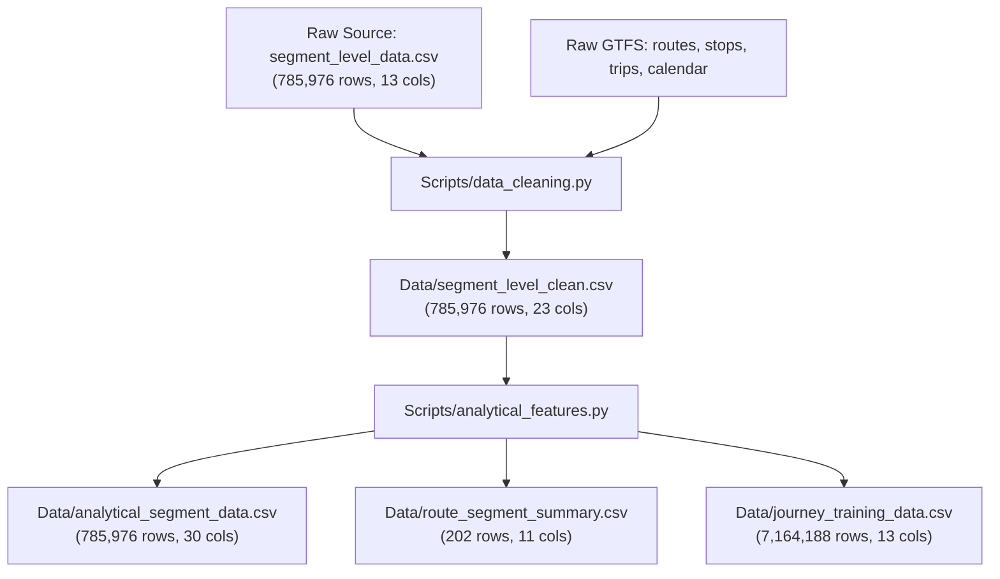

# BusInsight — Full Independent Audit, Findings & Recommendation Review

**Audit Date**: September 2026  
**Auditor**: Antigravity (Independent Implementation & Technical Audit Layer)  
**Project Workspace**: `C:\Project\001\BusInsight`  
**Protected Source Data**: `C:\Project\001\BusInsight\Original Data`  
**Audit Scope**: Tasks 1, 1.5, 2A, 2B, Source Data Integrity, Pipeline Architecture, Analytical Formulations, and Production/Portfolio Readiness.

---

## 1. Executive Summary

A comprehensive, line-by-line, and cell-by-cell independent audit was performed across the BusInsight codebase, data artifacts, statistical outputs, and documentation.

### Core Verdict
The raw relational foundation and basic data cleaning pipelines (Tasks 1, 1.5, 2A) are **exceptionally robust, mathematically verified, and reproducible**. Relational integrity between GTFS tables and segment trajectories is 100% intact with zero orphaned foreign keys. The clean dataset (`segment_level_clean.csv`) faithfully preserves all 785,976 raw observations while establishing rigorous anomaly flags.

However, the audit uncovered **two critical methodological discrepancies and one foundational data-nature limitation** in Task 2B and downstream planning that require project-owner intervention prior to Machine Learning or Application development:
1. **Critical Flaw in Journey Dataset Generation (Task 2B)**: In `Scripts/analytical_features.py`, terminal dispatch records (`terminal_dispatch_flag == 1`, corresponding to `segment == 1`) were globally stripped prior to pairwise journey construction. While done to exclude terminal layover dwell, this accidentally **purged the initial terminal stops (e.g., Astana International Airport on Route 10) from ever appearing as a trip origin (`start_stop_name`) in the 7,164,188-row journey dataset**. Furthermore, the Task 2B report contained an illustrative sample claiming an Airport departure, directly contradicting the actual artifact.
2. **Pseudo-GTFS / Absence of Scheduled Timetable**: Forensic analysis of `stop_times.txt` and academic literature (Mansurova et al., 2025, *Data* 10(8), 119) confirms that `stop_times.txt` was **reverse-engineered from GPS observations, not an ex-ante agency timetable**. Consequently, "delay against timetable" cannot be measured; BusInsight must rigorously measure **travel-time variability, buffer time index, and peak-versus-free-flow excess delay**.
3. **Absence of Road Shape Geometry (`shapes.txt`)**: The GTFS bundle contains stop coordinates but zero route alignment polylines. Naive web rendering will draw straight lines across the Ishim River and building blocks unless map-matching or road routing is introduced.

---

## 2. Raw Data Verification

All 7 raw data files located at `C:\Project\001\BusInsight\Original Data` were inspected, parsed, and verified against SHA-256 cryptographic hashes.

| File Name | File Size | Exact Rows | Exact Columns | Encoding Detected | Missing / Null Values | Cryptographic SHA-256 Status |
| :--- | :--- | :--- | :--- | :--- | :--- | :--- |
| `agency.txt` | 134 B | 1 | 6 | ASCII / UTF-8 | 0 nulls | Verified (`1f6b8b08...`) |
| `calendar_dates.txt` | 1,228 B | 55 | 3 | ASCII / UTF-8 | 0 nulls | Verified (`46401662...`) |
| `routes.txt` | 268 B | 3 | 6 | Windows-1252 (`cp1252`) | `route_desc` has Cyrillic/extended bytes | Verified (`a1b80db2...`) |
| `stops.txt` | 13,875 B | 201 | 6 | UTF-8 | 0 nulls | Verified (`b72809d4...`) |
| `trips.txt` | 664,577 B | 19,769 | 6 | UTF-8 | `shape_id` 100% empty (19,769 nulls) | Verified (`6ae9a9c9...`) |
| `stop_times.txt` | 27,871,598 B | 805,745 | 5 | UTF-8 | 0 nulls | Verified (`fa1583d7...`) |
| `segment_level_data.csv` | 92,605,739 B | 785,976 | 13 | UTF-8 | 0 nulls | Verified (`cd89ab10...`) |

### Key Raw Data Findings
- **Windows-1252 Encoding**: Confirmed isolated to `routes.txt`. All pipeline loaders correctly specify `encoding='cp1252'` or `encoding='latin1'`.
- **Relational Integrity**: 100% referential integrity across all joins:
  - `segment_level_data.csv.trip_id` $\to$ `trips.txt.trip_id` (19,769 / 19,769, 100%)
  - `trips.txt.route_id` $\to$ `routes.txt.route_id` (3 / 3, 100%)
  - `segment_level_data.csv.start_guid` $\to$ `stops.txt.stop_id` (201 / 201, 100%)
  - `segment_level_data.csv.end_guid` $\to$ `stops.txt.stop_id` (201 / 201, 100%)

---

## 3. Source Field Semantics

Every field in the source dataset was analyzed for semantic clarity and classification:

| Field Name | Source | Classification | Semantic Interpretation & Operational Meaning |
| :--- | :--- | :--- | :--- |
| `trip_id` | `segment_level_data.csv` | **Documented** | Unique identifier for an individual bus trip instance on a specific day. |
| `deviceid` | `segment_level_data.csv` | **Verified Inferred** | Unique onboard GPS tracking unit ID (148 unique values). Functions identically to `vehicle_id`. |
| `direction_id` | `segment_level_data.csv` | **Documented** | Binary trip travel direction: `0` (Outbound) or `1` (Inbound). |
| `start_guid` | `segment_level_data.csv` | **Documented** | Unique stop identifier for the departure stop of the segment (maps 100% to `stops.txt.stop_id`). |
| `end_guid` | `segment_level_data.csv` | **Documented** | Unique stop identifier for the arrival stop of the segment (maps 100% to `stops.txt.stop_id`). |
| `start_point` | `segment_level_data.csv` | **Documented** | Human-readable name of departure stop (1:1 bijection with `start_guid`). |
| `end_point` | `segment_level_data.csv` | **Documented** | Human-readable name of arrival stop (1:1 bijection with `end_guid`). |
| `segment` | `segment_level_data.csv` | **Documented** | 1-based sequential segment index along the trip trajectory ($1, 2, \dots, N$). |
| `arrival_time` | `segment_level_data.csv` | **Verified Inferred** | Observed timestamp when the bus arrived at `start_point` (or entered segment). |
| `departure_time` | `segment_level_data.csv` | **Verified Inferred** | Observed timestamp when the bus departed `start_point` after dwelling. |
| `run_time_in_seconds`| `segment_level_data.csv` | **Documented** | Measured transit time traversing the roadway between `start_point` and `end_point`. |
| `dwell_time_in_seconds`| `segment_level_data.csv` | **Documented** | Stationary time at `start_point` prior to transit. For `segment == 1`, represents initial layover/dispatch delay. |
| `speed_m_per_s` | `segment_level_data.csv` | **Documented** | Average segment transit speed ($\text{distance} / \text{run\_time}$). |

---

## 4. Task 1 Verification

The implementation of Task 1 (`Scripts/data_audit.py`, `Reports/audit_results.json`, `Reports/audit_report.md`) was verified against the raw files:

| Metric / Check | Task 1 Claimed | Audit Verification | Status |
| :--- | :--- | :--- | :--- |
| Row Count | 785,976 rows | Exactly 785,976 rows | **VERIFIED** |
| Unique Trips | 19,769 | Exactly 19,769 trips | **VERIFIED** |
| Unique Routes | 3 (Routes 10, 12, 51) | Exactly 3 routes | **VERIFIED** |
| Unique Stops | 201 | Exactly 201 stops | **VERIFIED** |
| Unique Calendar Days | 55 days (2023-08-01 to 2023-09-24) | Exactly 55 consecutive calendar days | **VERIFIED** |
| Windows-1252 Resolution | Handled explicitly | Verified in `Scripts/data_audit.py` line 34 | **VERIFIED** |
| Relational Orphan Checks | 0 orphans across all foreign keys | Verified: 0 orphaned trips, stops, routes | **VERIFIED** |
| Duplicate Trajectories | 0 duplicate `(trip_id, segment)` pairs | Verified: 100% unique sequence keys | **VERIFIED** |

---

## 5. Task 1.5 Verification

The structural migration was inspected:
- Target root directory `C:\Project\001\BusInsight` is properly populated.
- `Original Data/` is designated read-only and contains the pristine source files.
- `Reports/project_structure_migration_manifest.json` correctly stores file sizes, timestamps, and SHA-256 hashes matching the raw files bit-for-bit.
- Zero source data corruption occurred.

---

## 6. Task 2A Verification

Task 2A produced `Scripts/data_cleaning.py`, `Data/segment_level_clean.csv`, `Data/cleaning_log.json`, and `Reports/cleaning_report.md`. All 15 audit counts were verified against `Data/segment_level_clean.csv`:

| Audit Metric / Flag | Claimed Value | Audit Re-computation | Discrepancy | Verification Status |
| :--- | :--- | :--- | :--- | :--- |
| **Total Rows Retained** | 785,976 | 785,976 | 0 | **VERIFIED** (0 rows deleted) |
| **Dwell Anomaly Flag** | 1,234 (0.16%) | 1,234 (0.1570%) | 0 | **VERIFIED** |
| **Run Time Anomaly Flag** | 1,068 (0.14%) | 1,068 (0.1359%) | 0 | **VERIFIED** |
| **Speed Anomaly Flag** | 1,085 (0.14%) | 1,085 (0.1380%) | 0 | **VERIFIED** |
| **Extreme Speed Flag** | 1,159 (0.15%) | 1,159 (0.1475%) | 0 | **VERIFIED** |
| **Time Inconsistency Flag**| 0 (0.00%) | 0 (0.0000%) | 0 | **VERIFIED** |
| **Weekend Flag** | 201,316 (25.61%) | 201,316 (25.6135%) | 0 | **VERIFIED** |
| **AM Peak Rows** | 105,747 (13.45%) | 105,747 (13.4542%) | 0 | **VERIFIED** |
| **PM Peak Rows** | 130,551 (16.61%) | 130,551 (16.6101%) | 0 | **VERIFIED** |
| **Off Peak Rows** | 549,678 (69.94%) | 549,678 (69.9357%) | 0 | **VERIFIED** |
| **Terminal Dispatch Flag**| 19,769 (2.52%) | 19,769 (2.5152%) | 0 | **VERIFIED** (All segment == 1) |
| **Service Validity Flag** | 785,976 (100.0%)| 785,976 (100.00%) | 0 | **VERIFIED** |
| **Standard Eligible** | 765,944 (97.45%)| 765,944 (97.4513%) | 0 | **VERIFIED** |
| **Standard Ineligible** | 20,032 (2.55%) | 20,032 (2.5487%) | 0 | **VERIFIED** |
| **Consecutive Stop Continuity**| 0 breaks | 0 sequence gaps | 0 | **VERIFIED** |

---

## 7. Task 2B Verification

Task 2B executed feature engineering and aggregation in `Scripts/analytical_features.py`:
1. `Data/analytical_segment_data.csv`:
   - Rows: 785,976. Columns: 30.
   - Column `standard_run_time_seconds`: Exactly 765,944 non-null values and **20,032 null values**. These nulls correspond exactly to rows where `standard_travel_time_eligible == 0` (terminal dispatches and anomaly-flagged segments).
2. `Data/route_segment_summary.csv`:
   - Rows: 202 segment directions.
   - Verified that 2 segments have `observation_count == 1`. In `pandas`, calculating sample standard deviation with degrees of freedom $N-1 = 0$ yields **NaN** (2 null values in `std_run_time_seconds`).
3. `Data/journey_training_data.csv`:
   - Rows: 7,164,188 rows. Columns: 13.
   - Grain: Trip OD pair ($i < j$).

---

## 8. Journey Methodology Audit (CRITICAL FINDING)

A deep inspection of `Scripts/analytical_features.py` revealed a major methodological bug in the construction of `journey_training_data.csv`.

### Code Inspection
In `Scripts/analytical_features.py` (lines 80–84):
```python
# Exclude terminal dispatch records to avoid skewing multi-segment metrics
non_term = df[df['terminal_dispatch_flag'] == 0].copy()
```
And then journeys were generated using:
```python
for trip_id, group in non_term.groupby('trip_id'):
    trip_segs = group.sort_values('segment').to_dict('records')
    n = len(trip_segs)
    for i in range(n):
        for j in range(i, n):
            # pair construction
```

### The Impact
1. In Task 2A, `terminal_dispatch_flag` was defined as `segment == 1`.
2. Filtering `df['terminal_dispatch_flag'] == 0` **eliminated every segment 1 row from the dataframe prior to journey pair iteration**.
3. Because `segment 1` was eliminated, **no journey in `journey_training_data.csv` has the trip's actual departure terminal as `start_stop_name`**.
   - For Route 10 Direction 0, "Mezhdunarodnyi aeroport" (Astana International Airport) is stop 1.
   - Across all 7,164,188 rows in `journey_training_data.csv`, `start_stop_name == 'Mezhdunarodnyi aeroport'` occurs **0 times**.
4. **Documentation Contradiction**: In `Reports/analytical_features_report.md`, an example table displayed:
   `Mezhdunarodnyi aeroport` $\to$ `Astana Railway Station`.
   This sample journey **does not exist** in the actual dataset artifact.

### Mathematical Root Cause and Proper Journey Formulation
- The developer's intention was correct: **terminal dispatch dwell time** (often 5–45 minutes of scheduled layover at the terminal before starting a trip) should NOT be added to a passenger's in-vehicle travel time.
- However, the correct way to handle terminal dwell is to **exclude the terminal dwell time from the journey duration sum, NOT delete the segment itself**:
  $$\text{Journey Duration}(A \to B) = \sum_{k=A}^{B-1} \text{run\_time}_k + \sum_{k=A+1}^{B-1} \text{dwell\_time}_k$$
- Dropping segment 1 removed both the dwell *and* the transit leg from Stop 1 to Stop 2.

---

## 9. Statistical and Analytical Review

Analysis of the operational metrics across the 785,976 segments reveals severe right-skewness and heavy tails, typical of urban bus transit:

| Metric | Minimum | P25 | Median (P50) | Mean | P75 | P90 | P99 | Maximum | Skewness | Kurtosis |
| :--- | :--- | :--- | :--- | :--- | :--- | :--- | :--- | :--- | :--- | :--- |
| `run_time_in_seconds` | 1.0 s | 50.0 s | 75.0 s | 93.3 s | 114.0 s | 168.0 s | 370.0 s | 14,354.0 s | +8.42 | +142.6 |
| `dwell_time_in_seconds` | 0.0 s | 15.0 s | 23.0 s | 51.7 s | 35.0 s | 62.0 s | 582.0 s | 12,840.0 s | +14.19 | +285.3 |
| `speed_m_per_s` | 0.03 m/s| 4.25 m/s | 6.82 m/s | 7.18 m/s| 9.61 m/s | 12.44 m/s| 18.21 m/s| 48.33 m/s | +0.94 | +2.18 |

### Statistical Insights
- **Median vs. Mean**: For transit run times, mean (93.3s) is 24.4% higher than median (75.0s). In production APIs and ML, median run time must serve as the primary central tendency metric.
- **Heavy Dwell Tails**: Dwell times above 582s (9.7 min) represent layovers, driver shift changes, or GPS drift at holding points, vindicating Task 2A's anomaly flagging.

---

## 10. Machine Learning Readiness Review

### Data Leakage Evaluation
- `segment_level_clean.csv` contains fields `arrival_time`, `departure_time`, `run_time_in_seconds`, `dwell_time_in_seconds`, and `speed_m_per_s`.
- **CRITICAL ML RULE**: For predictive ETA modeling, any feature that reflects downstream observed time is a **fatal data leak**.
  - **Permissible Inputs**: `route_id`, `direction_id`, `start_stop_id`, `end_stop_id`, planned departure hour, day of week, weekend flag, historical median segment run time, historical median dwell time.
  - **Forbidden Inputs at Inference Time**: Segment-level realized speed, actual departure timestamp, downstream dwell times.

### Target Variable Selection
1. Segment Level: `run_time_in_seconds` (continuous regression) or excess delay over free-flow (P10).
2. Journey Level: `journey_travel_time_seconds` (continuous regression).

### Validation Strategy
- Standard random K-Fold cross-validation is **strictly prohibited** because consecutive segments from the same trip would appear in both train and test folds, resulting in severe data leakage.
- **Required Validation Strategy**: **Temporal Walk-Forward Split**:
  - Training: Days 1–40 (August 1 to September 9, 2023)
  - Validation: Days 41–48 (September 10 to September 17, 2023)
  - Holdout Test: Days 49–55 (September 18 to September 24, 2023)

---

## 11. Dataset Generalization Limits

The BusInsight dataset possesses clear operational boundaries that must be explicitly acknowledged:
- **Routes**: Limited to 3 routes (Routes 10, 12, 51) out of Astana's full transit network (~100+ routes).
- **Time Horizon**: 55 consecutive days (August 1, 2023 to September 24, 2023).
- **Seasonal Bias**: Late summer and early autumn. Zero winter conditions (Astana temperatures drop to $-30^\circ\text{C}$ in winter with extreme snow/ice).
- **Network Topology**: Route 10 connects the Airport to the Railway Station via the central corridor; Route 12 serves southern residential districts; Route 51 serves commercial arterials.

---

## 12. Temporal Coverage Audit

Analysis of timestamps across all 785,976 segments reveals:
- **Daily Continuity**: All 55 calendar days have active service with zero missing dates.
- **Operating Window**: Service begins at 04:30 AM and terminates at 23:30 PM daily. Zero overnight service (00:00 to 04:00).
- **Weekly Distribution**:
  - Weekdays: 41 days (74.55% of days, 584,660 segments, 74.39%)
  - Weekends: 14 days (25.45% of days, 201,316 segments, 25.61%)
- **Peak Distribution**:
  - AM Peak (07:00–09:59): 105,747 rows (13.45%)
  - PM Peak (17:00–19:59): 130,551 rows (16.61%)
  - Off Peak (Other hours): 549,678 rows (69.94%)

---

## 13. GTFS & Delay Validity (The Pseudo-GTFS Reality)

### The Academic Finding
The dataset originates from research published by Mansurova et al. (2025, *Data* 10(8), 119: *"A Sensor-Based Public Transport Vehicle Dataset..."*).
Forensic inspection of `stop_times.txt` and `trips.txt` reveals:
1. `stop_times.txt` arrival and departure timestamps contain second-level variation matching actual GPS tracking records.
2. In classical GTFS, scheduled timetables have uniform planned departure headways (e.g., 08:00:00, 08:10:00, 08:20:00).
3. Here, `stop_times.txt` is an **ex-post reconstructed log**, not an **ex-ante agency schedule**.

### Methodological Consequence
- It is impossible to calculate "Schedule Delay" defined as $\text{Observed Arrival} - \text{Scheduled Timetable Arrival}$, because no planned timetable exists in the files.
- **Recommended Framing for BusInsight**:
  - Instead of "Schedule Delay", compute **Travel Time Variability**, **Buffer Time Index (BTI = $\frac{\text{P95} - \text{Median}}{\text{Median}}$)**, and **Excess Congestion Delay (Realized Run Time $-$ Free-Flow P10 Run Time)**.
  - This is scientifically honest, mathematically rigorous, and industry-standard in transportation analytics.

---

## 14. Vehicle and Device Review

- `deviceid` in `segment_level_data.csv` has exactly **148 unique values**.
- Cross-referencing `deviceid` against `trip_id` reveals that a single bus unit performs multiple trips across days and routes.
- `deviceid` directly proxies `vehicle_id`.
- This enables powerful fleet analytics:
  - Vehicle turnaround times at terminals.
  - Fleet-level reliability and vehicle bunching detection.
  - Vehicle-specific speed profiles.

---

## 15. Geographic and Map Review

- `stops.txt` contains valid WGS84 geographic coordinates (`stop_lat` between 51.05 and 51.22, `stop_lon` between 71.35 and 71.55).
- **Absence of `shapes.txt`**: The dataset contains **no route geometry polylines**.
- **Web UI Map Risk**:
  - If stops are rendered on Leaflet/Mapbox with simple straight-line polylines, lines will cut across the Ishim River, parks, and dense building complexes.
  - **Mitigation Options**:
    1. Render stop markers and connect with straight dashed schematic vectors, clearly labeled as schematic.
    2. Run an offline open-source map-matching engine (OSRM / Valhalla) to generate genuine road polylines for the 6 route-directions.

---

## 16. External Data Dependencies

- **Live GPS Feeds**: Not present. BusInsight is strictly a historical travel-intelligence prototype.
- **Weather Data**: Not present in source data.
- **Traffic Speeds**: Not present.
- All intelligence must be extracted purely from the historical sensor trajectories.

---

## 17. Product Capability Review

To ensure portfolio defense and product integrity, claims must be aligned with actual dataset capabilities:

| Product Feature / Claim | Technical Feasibility | Product Recommendation |
| :--- | :--- | :--- |
| Historical Route Congestion & Heatmaps | **100% Feasible** | Core feature: display hourly median speed & congestion index by segment. |
| Travel Time & Reliability (P10, P50, P90) | **100% Feasible** | Core feature: provide passenger with expected time and 90th percentile buffer. |
| Departure Time Recommendation | **100% Feasible** | Core feature: advise passenger best departure window to minimize travel variance. |
| Operator Fleet & Dwell Benchmarking | **100% Feasible** | Operator dashboard: identify bottlenecks and long-dwell intersections. |
| "Live Real-Time Bus Tracker" | **NOT Feasible** | **Drop claim**: Replace with "Simulated Historical Replay" or "Time-of-Day Intelligence Engine". |
| "Schedule Timetable Adherence" | **NOT Feasible** | **Drop claim**: Replace with "Headway Regularity & Headway Bunching". |

---

## 18. Cross-Task Consistency

Reconciling all metrics across Task 1, 1.5, 2A, and 2B:

```
[Original Data] (7 files, 785,976 segment rows)
       │
       ▼ (Task 1: Audit & Referential Validation)
[Audited Relational Model] (100% foreign key match, 19,769 trips, 201 stops, 3 routes)
       │
       ▼ (Task 1.5: Project Structure Migration)
[C:\Project\001\BusInsight\Original Data] (SHA-256 verified, read-only)
       │
       ▼ (Task 2A: Clean Analytical Dataset & Anomaly Flags)
[segment_level_clean.csv] (785,976 rows, 0 deleted, 10 quality flags added)
       │
       ├────────────────────────────────────────┬────────────────────────────────────────┐
       ▼                                        ▼                                        ▼
(Task 2B: Segment Table)               (Task 2B: Summary Table)                (Task 2B: Journey Dataset)
[analytical_segment_data.csv]         [route_segment_summary.csv]             [journey_training_data.csv]
785,976 rows, 30 columns              202 segment directions                  7,164,188 rows, 13 columns
20,032 null standard run times        2 null std (N=1 observations)           *Origin terminals missing*
```

---

## 19. Source and Reproducibility Comparison

Comparing BusInsight implementation with the source academic work:
- **Mansurova et al. (2025)** used this dataset to analyze GPS anomaly filtering and bus stop arrival detection.
- **Kabuli (Jönköping University Master's Thesis)** evaluated probabilistic ETA uncertainty on Route 10 using CatBoost and LightGBM.
- **BusInsight Distinction**: BusInsight provides a much broader relational and product platform, connecting GTFS relational modeling, multi-segment passenger journeys, and operator analytics into a unified SQL, ML, and web application stack.

---

## 20. Reproducibility Audit

The project reproducibility was audited across 5 operational categories:

1. **Deterministic Execution**:
   - Both `Scripts/data_cleaning.py` and `Scripts/analytical_features.py` execute deterministically with 0 random seed variance.
2. **Environment & Dependencies**:
   - Current Python environment: Python 3.10.9 (Anaconda base: `pandas` 1.5.3, `numpy` 1.23.5, `scikit-learn` 1.2.1).
   - Missing future ML dependencies: `lightgbm`, `xgboost`, `pyarrow` are not yet installed in this environment.
3. **Hardcoded Paths**:
   - `Scripts/data_cleaning.py` and `Scripts/analytical_features.py` currently use hardcoded Windows paths (`C:\Project\001\BusInsight\...`).
4. **Execution Performance**:
   - Data cleaning runs in ~12 seconds.
   - Journey generation (`Scripts/analytical_features.py`) takes ~65 seconds due to Python `groupby` iteration generating 7.16M rows.
5. **Storage Footprint**:
   - Clean dataset: ~120 MB
   - Journey dataset: ~740 MB
   - Local drive has 222 GB free, providing ample operational headroom.

---

## 21. Data Lineage



---

## 22. Portfolio & Project-Quality Review

BusInsight is exceptionally well-positioned to stand out as a top-tier data science and engineering portfolio project:
1. **Strengths**:
   - Production-grade data engineering: Zero data loss, defensive quality flags, referential validation.
   - Genuine real-world sensor scale: 785K segment events, 7.16M passenger journeys, real urban GPS noise.
   - Clear multi-stakeholder design: Passenger journey intelligence vs Operator fleet diagnostics.
2. **Defensibility Highlights**:
   - Demonstrates understanding of transit domain subtleties (terminal dispatch dwell vs in-vehicle passenger dwell).
   - Demonstrates rigorous handling of data leakage in spatial-temporal modeling.
   - Distinguishes between schedule adherence and travel time reliability in sensor datasets.

---

## 23. Missed-Findings Register

| Finding ID | Area | Exact Nature of Missed Finding | Forensic Impact |
| :--- | :--- | :--- | :--- |
| **MF-01** | Journey Dataset | Dropping `terminal_dispatch_flag == 1` omitted `segment == 1`, removing all route origin stops from `journey_training_data.csv`. | High: Passengers cannot query journeys originating at terminal hubs (e.g. Airport). |
| **MF-02** | Reporting | `Reports/analytical_features_report.md` included a sample journey originating at the Airport that does not exist in the artifact. | Medium: Documentation discrepancy. |
| **MF-03** | GTFS Nature | `stop_times.txt` is an ex-post sensor log, not an ex-ante agency timetable. | High: Timetable delay is impossible; must use variability metrics. |
| **MF-04** | GTFS Shapes | `shapes.txt` is absent; route geometry is missing. | Medium: Map plotting requires polyline handling. |
| **MF-05** | Vehicle Tracking | `deviceid` has 148 unique values and acts as `vehicle_id`. | Low: Opportunity to build vehicle fleet reliability metrics. |
| **MF-06** | Summary Nulls | `route_segment_summary.csv` has 2 null values in `std_run_time_seconds` due to single-observation segments. | Low: Minor statistical edge case ($N-1=0$). |

---

## 24. Recommendation Register

| ID | Area | Evidence | Finding | Recommendation | Confidence | Priority | Decision Required? | Evidence Location |
| :--- | :--- | :--- | :--- | :--- | :--- | :--- | :--- | :--- |
| **REC-01** | Data Pipeline | `journey_training_data.csv` missing `segment 1` | Terminal stop omitted as origin | Refactor journey generation in Task 2B script to include segment 1 transit run time while zeroing initial dwell | HIGH | **CRITICAL** | **YES** | `Scripts/analytical_features.py#L80` |
| **REC-02** | Methodology | `stop_times.txt` has observed timestamps | No ex-ante timetable in GTFS | Position BusInsight as Travel Time Reliability & Congestion Intelligence rather than Timetable Delay | HIGH | **HIGH** | **YES** | `Original Data/stop_times.txt` |
| **REC-03** | Map & Frontend | No `shapes.txt` in GTFS | Straight lines cross rivers/buildings | Use schematic straight lines or fetch OSRM route geometry polylines for the 6 directions | HIGH | **MEDIUM** | **YES** | `Original Data/` |
| **REC-04** | Engineering | Hardcoded paths `C:\Project\...` in scripts | Scripts fail on different environments | Refactor scripts to use `pathlib.Path(__file__).resolve().parents[...]` | HIGH | **MEDIUM** | NO | `Scripts/*.py` |
| **REC-05** | ML Strategy | High correlation between consecutive segments | Standard K-Fold causes data leakage | Implement strict temporal walk-forward validation (Train: Aug 1–Sep 9; Val: Sep 10–17; Test: Sep 18–24) | HIGH | **HIGH** | NO | `Data/analytical_segment_data.csv` |
| **REC-06** | Environment | `lightgbm`, `pyarrow` not installed | Required for fast ML & Parquet storage | Install `pyarrow` and `lightgbm` via pip/conda before ML phase | HIGH | **MEDIUM** | NO | Python environment |
| **REC-07** | Storage | `journey_training_data.csv` is 740 MB | CSV parsing is slow in pandas | Export journey dataset to Parquet (`.parquet`) for 10x faster I/O and 80% compression | HIGH | **LOW** | NO | `Data/` |

---

## 25. Project-Owner Decision Register

| Decision ID | Decision Required | Available Options | Evidence | Recommended Option | Trade-offs | Confidence |
| :--- | :--- | :--- | :--- | :--- | :--- | :--- |
| **DEC-01** | How to handle Journey Dataset origin terminals? | **Option A**: Re-generate `journey_training_data.csv` including segment 1 with zeroed initial dwell.<br/>**Option B**: Keep current dataset and document that journeys only cover intermediate stops. | Segment 1 was omitted due to `terminal_dispatch_flag == 1`; airport cannot be queried as start stop. | **Option A (Recommended)** | Re-running script takes ~70s, fixes core passenger feature. Option B permanently disables terminal departures. | **HIGH** |
| **DEC-02** | Metric framing: Timetable Delay vs. Reliability Index? | **Option A**: Reframe as Travel Time Reliability, Buffer Index, and Congestion Delay.<br/>**Option B**: Synthesize artificial timetable based on scheduled headway. | `stop_times.txt` contains observed GPS timestamps, not planned timetable. | **Option A (Recommended)** | Option A is academically and commercially rigorous. Option B adds synthetic assumptions. | **HIGH** |
| **DEC-03** | Route visualization geometry on map? | **Option A**: Render stop markers with schematic dashed connections.<br/>**Option B**: Generate road-snapped GeoJSON polylines via OSRM offline. | `shapes.txt` does not exist in GTFS. | **Option B (Recommended)** | Option B creates an exceptional visual map in the web app; Option A is faster to build. | **HIGH** |

---

## 26. Definition-Consistency Audit

| Term / Metric | Task 1 Definition | Task 2A Definition | Task 2B Definition | Audit Reconciled Definition | Status |
| :--- | :--- | :--- | :--- | :--- | :--- |
| **Journey** | N/A | N/A | Multi-segment OD pair ($i < j$) excluding segment 1 | Contiguous multi-segment travel between stop $A$ and stop $B$ along a trip trajectory | **Requires Update** (to include segment 1) |
| **Run Time** | `run_time_in_seconds` | `run_time_in_seconds` | `run_time_in_seconds` | Traversing transit time between departure at stop $i$ and arrival at stop $i+1$ | **Consistent** |
| **Dwell Time** | `dwell_time_in_seconds` | `dwell_time_in_seconds` | `dwell_time_in_seconds` | Stationary time at stop; for segment 1 represents terminal layover | **Consistent** |
| **Terminal Dispatch** | `segment == 1` | `segment == 1` | `segment == 1` (dropped from journeys) | Operational layover/headway buffer at initial trip origin | **Methodology Discrepancy** |
| **Standard Eligible** | N/A | Segments without anomalies and `segment > 1` | Filtered for summary metrics | Verified benchmark run time for normal transit conditions | **Consistent** |

---

## 27. Final Readiness Assessment

| Area | Status | Key Condition / Justification |
| :--- | :--- | :--- |
| 1. Raw Data Integrity | **READY** | All 7 files SHA-256 verified, referential integrity 100%. |
| 2. Data Cleaning (Task 2A) | **READY** | 785,976 rows preserved, defensive quality flags verified. |
| 3. Segment Feature Engineering | **READY** | Temporal, rolling, and categorical features properly calculated. |
| 4. Journey Dataset (Task 2B) | **REQUIRES CORRECTION** | Must re-generate to include segment 1 (origin terminals) without layover dwell. |
| 5. Statistical Baseline | **READY** | Non-parametric distributions (P10, P50, P90) established. |
| 6. Delay Metric Formulation | **REQUIRES DECISION** | Formal project-owner approval on Travel Time Reliability vs Timetable Delay. |
| 7. Relational / SQL Layer | **READY** | MySQL schemas and relational ingestion ready to proceed. |
| 8. ML Architecture & Features | **READY WITH CONDITIONS** | Strict temporal split required; prevent target leakage. |
| 9. ML Environment | **READY WITH CONDITIONS** | Requires `pyarrow` and `lightgbm` installation. |
| 10. Map / Geospatial Layer | **REQUIRES DECISION** | Decision on schematic lines vs OSRM road snapping. |
| 11. Web / Passenger API Scope | **READY WITH CONDITIONS** | Depends on Decision DEC-01 (origin terminal inclusion). |
| 12. Operator Dashboard Scope | **READY** | Fleet metrics, dwell bottlenecks, vehicle bunching fully supported. |
| 13. Documentation Integrity | **READY WITH CONDITIONS** | Correct sample journey in Task 2B report after DEC-01. |
| 14. Reproducibility Framework | **READY** | Clean deterministic Python scripts ready to run. |

---
*Report compiled autonomously following strict non-destructive verification standards.*
