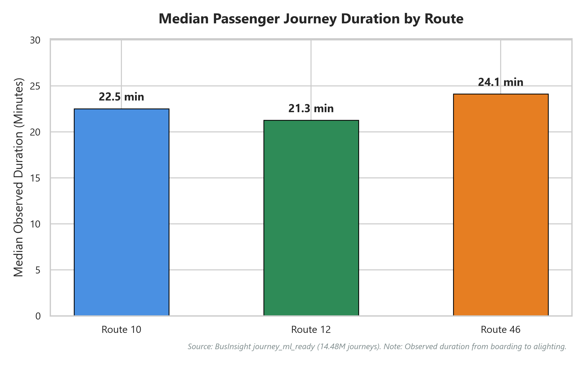
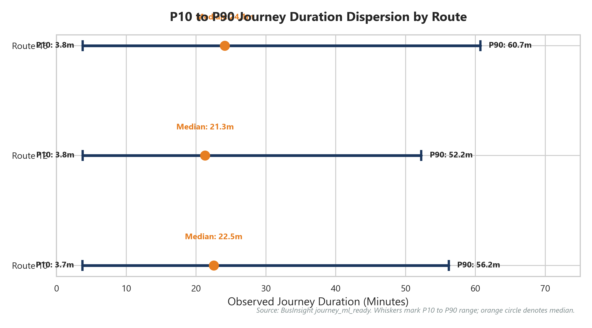
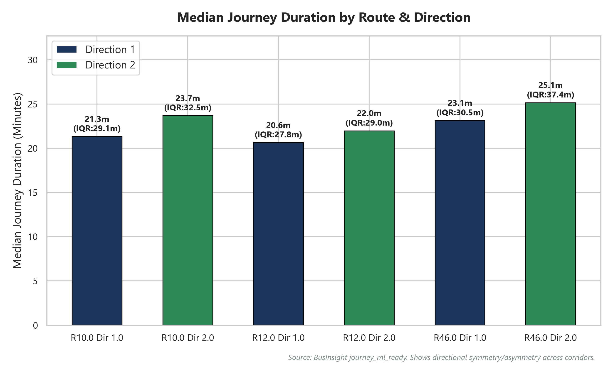
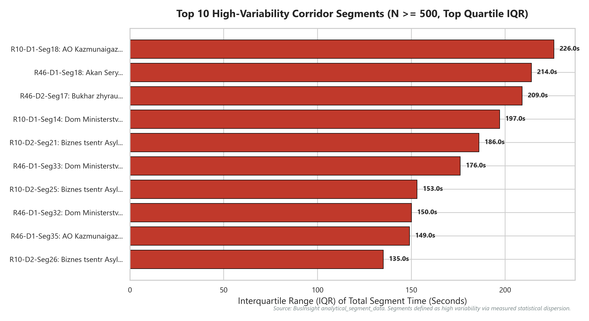
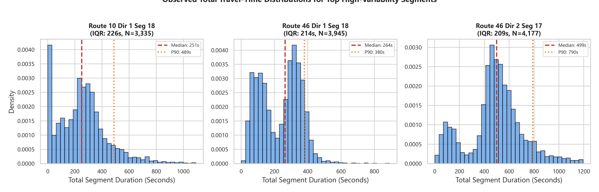
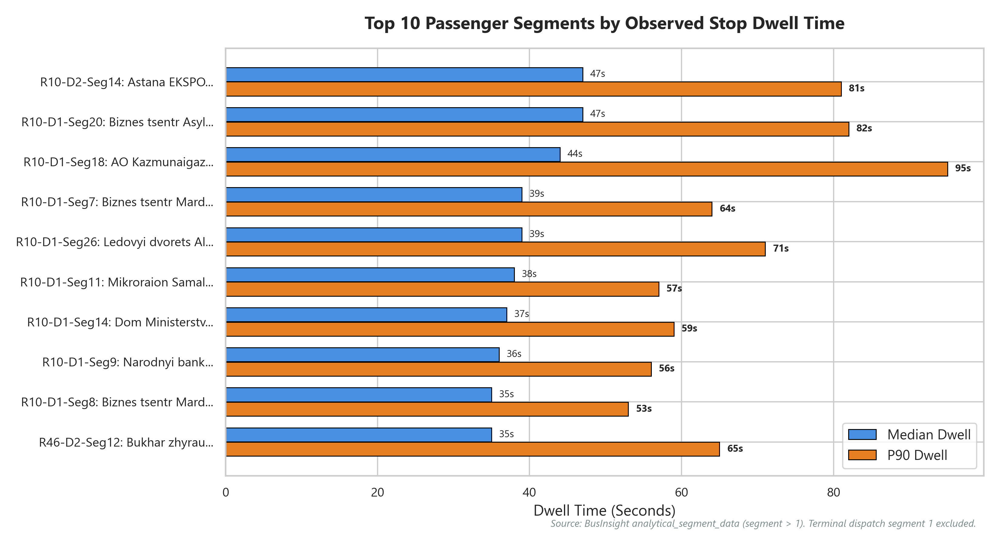
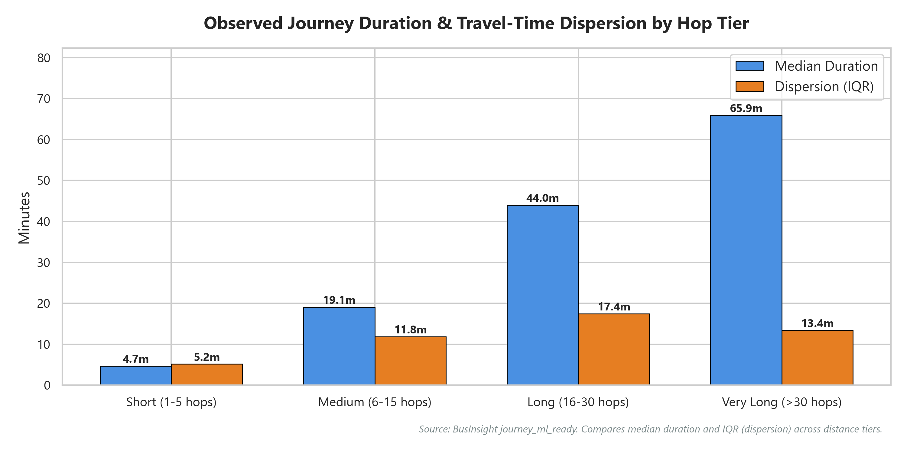
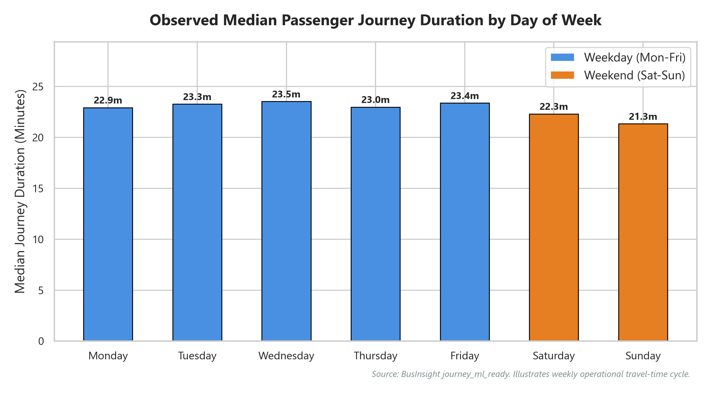

# Task 4 — SQL & Exploratory Data Analysis

**Project**: BusInsight  
**Task**: Task 4 — SQL + Exploratory Data Analysis + Operational Insights  
**Execution Date**: 2026-09-20  
**Project Root**: `C:\Project\001\BusInsight`  
**Status**: Validated & Complete  

---

## 1. Objective

The objective of Task 4 is to establish a comprehensive Data Analyst layer for the BusInsight transit analytics platform. Building upon the validated data cleaning (Task 2A), analytical dataset engineering (Task 2B), ML methodology lock (Task 2C), and machine-learning benchmarking (Task 3), this task conducts rigorous exploratory data analysis (EDA) and SQL-driven operational investigation to answer:

1. How do observed travel times, hop lengths, and dispersion metrics vary across routes, directions, and days of the week?
2. How does stop dwell time contribute to total corridor duration, and how does ordinary passenger stop dwell compare with terminal dispatch holding?
3. Which corridor segments exhibit the highest measured travel-time variability based on reproducible statistical criteria?
4. What operational implications emerge for transit dispatchers and passenger journey planning without inferring unmeasured causes?

---

## 2. Data Sources

The analysis queries three primary derived analytical artifacts without duplicating or modifying them:

| Source Dataset | Path | Total Records | Scope / Role |
| :--- | :--- | :---: | :--- |
| **Analytical Segment Data** | `Data\analytical_segment_data.csv` | 785,976 | Microscopic segment-level travel times, dwell times, and operational flags across 19,769 trips. Retains September 3–4 records. |
| **Journey Training Data** | `Data\journey_training_data.csv` | 15,277,204 | Macroscopic stop-to-stop journey pairs constructed across consecutive segment sequences. Excludes Segment 1 origins. |
| **Journey ML-Ready Data** | `Data\journey_ml_ready.csv` | 14,477,686 | Standard-eligible stop-to-stop journey observations excluding September 3–4 reduced-coverage dates and zero-duration records. |

All SQL operations are executed against a lightweight database catalog (`SQL/businsight.duckdb`, 268 KB) utilizing DuckDB view-backed connections directly referencing the existing CSV files, preventing memory bloat and preserving file integrity.

---

## 3. SQL Analysis

Six production SQL scripts were created in `SQL/` using Common Table Expressions (CTEs), explicit grouping, and descriptive statistical functions:

1. [`SQL/01_route_overview.sql`](file:///C:/Project/001/BusInsight/SQL/01_route_overview.sql): Route operational overview and journey-observation totals (trips, dates, devices, stops, segment durations, and generated stop-to-stop journey observations).
2. [`SQL/02_route_direction_performance.sql`](file:///C:/Project/001/BusInsight/SQL/02_route_direction_performance.sql): Directional travel-time distributions (Median, P10, P90, IQR, StdDev, and CV) for segment runs and generated journey observations.
3. [`SQL/03_segment_performance.sql`](file:///C:/Project/001/BusInsight/SQL/03_segment_performance.sql): Corridor segment performance across all 300 non-terminal segments, implementing the reproducible high-variability segment classification rule.
4. [`SQL/04_travel_time_variability.sql`](file:///C:/Project/001/BusInsight/SQL/04_travel_time_variability.sql): Dwell time analysis separating standard passenger stops from terminal dispatch (Segment 1), computing zero-dwell rates, high-dwell thresholds (>30s, >60s), and dwell share of total duration.
5. [`SQL/05_journey_analysis.sql`](file:///C:/Project/001/BusInsight/SQL/05_journey_analysis.sql): Journey duration distributions grouped by distance tier (1–5, 6–15, 16–30, >30 hops) and day of week.
6. [`SQL/06_data_quality_checks.sql`](file:///C:/Project/001/BusInsight/SQL/06_data_quality_checks.sql): 12 automated integrity checks verifying row counts, uniqueness, non-negativity, route/direction isolation, and boundary conditions.

---

## 4. Route-Level Findings

Aggregations from `Data/eda_route_summary.csv` and `SQL/01_route_overview.sql` summarize the operational scope of the three monitored corridors:

| Metric | Route 10 | Route 12 | Route 46 |
| :--- | :---: | :---: | :---: |
| **Route Name** | Railway Station – Airport | Railway Station – Airport | Karasu St – Comfort Town |
| **Segment Observations** | 243,243 | 207,655 | 335,078 |
| **Distinct Trips** | 6,480 | 5,150 | 8,139 |
| **Distinct Operating Dates** | 55 | 55 | 55 |
| **Distinct GPS Devices / Vehicles** | 35 | 83 | 83 |
| **Distinct Stops** | 119 | 149 | 118 |
| **Distinct Segments** | 51 | 56 | 50 |
| **Standard Segment Median Run Time** | 72.0 s | 68.0 s | 70.0 s |
| **Standard Segment Median Dwell Time** | 26.0 s | 24.0 s | 23.0 s |
| **Median Observed Total Segment Duration (Standard Segments)** | 100.0 s | 94.0 s | 96.0 s |
| **Standard Segment Total Time IQR** | 72.0 s | 70.0 s | 82.0 s |
| **Generated Stop-to-Stop Journey Observations** | 4,270,093 | 3,906,789 | 6,300,804 |
| **Median Journey Duration** | **22.53 min** (1,352 s) | **21.28 min** (1,277 s) | **24.12 min** (1,447 s) |
| **P10 Journey Duration** | 3.72 min (223 s) | 3.77 min (226 s) | 3.75 min (225 s) |
| **P90 Journey Duration** | **56.20 min** (3,372 s) | **52.25 min** (3,135 s) | **60.70 min** (3,642 s) |



### Key Route-Level Observations:
1. **Journey Duration Scaling**: Route 46 exhibits the longest median journey duration (24.12 min) and the highest P90 duration (60.70 min), reflecting its longer corridor span and the highest number of generated journey observations (6.30M observations).
2. **Segment Duration**: Route 12 has the lowest median observed total segment duration for standard corridor segments (94.0 s total = 68.0 s run + 24.0 s dwell), compared to 100.0 s on Route 10 and 96.0 s on Route 46.
3. **P10–P90 Spread**: As depicted in Figure 2, the observed 10th-to-90th percentile journey time range spans 52.48 minutes on Route 10 (3.72m to 56.20m), 48.48 minutes on Route 12 (3.77m to 52.25m), and 56.95 minutes on Route 46 (3.75m to 60.70m).



---

## 5. Direction-Level Findings

Aggregations from `Data/eda_route_direction_summary.csv` and `SQL/02_route_direction_performance.sql` evaluate directional travel times:

| Route & Direction | Trips | Seg. Obs | Median Seg Duration | Journey Obs | Median Journey (min) | P10 Journey (min) | P90 Journey (min) | P10–P90 Range (min) | Journey CV |
| :--- | :---: | :---: | :---: | :---: | :---: | :---: | :---: | :---: | :---: |
| **Route 10 Dir 1** | 3,335 | 118,817 | 106.0 s | 1,953,241 | **21.32 min** | 3.65 min | 53.57 min | 49.92 min | 0.7497 |
| **Route 10 Dir 2** | 3,145 | 124,426 | 94.0 s | 2,316,852 | **23.68 min** | 3.78 min | 58.23 min | 54.45 min | 0.7450 |
| **Route 12 Dir 1** | 2,921 | 111,764 | 98.0 s | 1,943,260 | **20.63 min** | 3.60 min | 51.20 min | 47.60 min | 0.7455 |
| **Route 12 Dir 2** | 2,229 | 95,891 | 90.0 s | 1,963,529 | **21.97 min** | 3.95 min | 53.30 min | 49.35 min | 0.7321 |
| **Route 46 Dir 1** | 3,950 | 159,983 | 95.0 s | 3,023,786 | **23.12 min** | 3.72 min | 55.68 min | 51.97 min | 0.7403 |
| **Route 46 Dir 2** | 4,189 | 175,095 | 97.0 s | 3,277,018 | **25.15 min** | 3.77 min | 65.00 min | 61.23 min | 0.7688 |



### Directional Insights:
1. **Directional Asymmetry**: On all three routes, Direction 2 exhibits higher median journey durations than Direction 1:
   - Route 10: Dir 2 is +2.36 minutes longer (23.68 min vs 21.32 min).
   - Route 12: Dir 2 is +1.34 minutes longer (21.97 min vs 20.63 min).
   - Route 46: Dir 2 is +2.03 minutes longer (25.15 min vs 23.12 min).
2. **P90 Tail Spread**: Route 46 Direction 2 displays the widest observed dispersion in the dataset, reaching a P90 duration of 65.00 minutes and a P10–P90 spread of 61.23 minutes.
3. **Relative Dispersion**: The coefficient of variation (CV) remains remarkably stable across routes and directions (ranging between 0.7321 and 0.7688), demonstrating that travel-time variance is proportional to mean journey length across all corridors.

---

## 6. Segment-Level Findings & High-Variability Corridor Segments

Corridor travel time was analyzed across all 300 non-terminal physical segments (`Data/eda_segment_summary.csv` and `SQL/03_segment_performance.sql`).

### High-Variability Segment Definition:
To avoid arbitrary rankings, a segment is classified as a **High-Variability Segment** if it meets two objective statistical criteria:
1. **Minimum Sample Size**: $N \ge 500$ observations to exclude low-frequency detours and anomalous single-day deviations.
2. **Upper Quartile Dispersion**: The segment's Interquartile Range of total segment time ($\text{IQR} = \text{P75} - \text{P25}$) falls in the upper quartile ($\ge 75\text{th percentile}$, corresponding to $\text{IQR} \ge 68.0\text{ seconds}$) of all eligible corridor segments.

Out of 300 physical segments, exactly **62 segments** satisfy this definition.

### Top 10 High-Variability Segments:

| Route | Dir | Seg | Boarding Stop Sample | Alighting Stop Sample | $N$ Obs | Median Total (s) | P90 Total (s) | IQR Total (s) | StdDev (s) | CV |
| :---: | :---: | :---: | :--- | :--- | :---: | :---: | :---: | :---: | :---: | :---: |
| **10** | 1 | 18 | AO Kazmunaigaz | AO Kazmunaigaz | 3,335 | 251.0 s | 488.6 s | **226.0 s** | 198.66 s | 0.7566 |
| **46** | 1 | 18 | Akan Sery | Akan Sery | 3,945 | 264.0 s | 380.0 s | **214.0 s** | 132.95 s | 0.5630 |
| **46** | 2 | 17 | Bukhar zhyrau | Dom ministerstv | 4,177 | 499.0 s | 790.0 s | **209.0 s** | 297.28 s | 0.5772 |
| **10** | 1 | 14 | Dom Ministerstv | Dom Ministerstv | 3,321 | 372.0 s | 670.0 s | **197.0 s** | 202.17 s | 0.4687 |
| **10** | 2 | 21 | Biznes tsentr Asyl-Tau | Biznes tsentr Asyl-Tau | 3,145 | 370.0 s | 576.6 s | **186.0 s** | 188.02 s | 0.4801 |
| **46** | 1 | 33 | Dom Ministerstv | Dom Ministerstv | 3,939 | 87.0 s | 281.2 s | **176.0 s** | 137.79 s | 1.0352 |
| **10** | 2 | 25 | Biznes tsentr Asyl-Tau | Biznes tsentr Asyl-Tau | 3,144 | 200.0 s | 471.0 s | **153.0 s** | 193.60 s | 0.7604 |
| **46** | 1 | 32 | Dom Ministerstv | Dom Ministerstv | 3,944 | 130.0 s | 305.0 s | **150.0 s** | 138.18 s | 0.8176 |
| **46** | 1 | 38 | Dom Ministerstv | Dom Ministerstv | 3,941 | 104.0 s | 258.0 s | **145.0 s** | 133.72 s | 0.8805 |
| **12** | 1 | 17 | AO Kazmunaigaz | AO Kazmunaigaz | 2,921 | 179.0 s | 372.0 s | **141.0 s** | 186.13 s | 0.7816 |





---

## 7. Dwell-Time Analysis

Dwell-time dynamics were analyzed using `Data/eda_dwell_summary.csv` and `SQL/04_travel_time_variability.sql`.

### A. Terminal Dispatch (Segment 1) vs Standard Passenger Stops (Segment > 1):

| Route & Direction | Segment Category | Observations | Avg Dwell (s) | Median Dwell (s) | P90 Dwell (s) | Zero Dwell % | Dwell >30s % | Dwell >60s % | Dwell Share of Total Time |
| :--- | :--- | :---: | :---: | :---: | :---: | :---: | :---: | :---: | :---: |
| **Route 10 Dir 1** | Terminal Dispatch (Seg 1) | 3,334 | 990.91 s | 506.5 s | 2,372.0 s | 0.09% | 89.50% | 82.69% | 50.00% |
| **Route 10 Dir 1** | Standard Stops (Seg > 1) | 115,483 | 29.17 s | 27.0 s | 53.0 s | 6.29% | 41.55% | 6.60% | 23.06% |
| **Route 10 Dir 2** | Terminal Dispatch (Seg 1) | 3,114 | 53.49 s | 38.0 s | 80.0 s | 0.55% | 69.94% | 17.34% | 50.00% |
| **Route 10 Dir 2** | Standard Stops (Seg > 1) | 121,312 | 27.04 s | 25.0 s | 45.0 s | 7.17% | 31.19% | 3.98% | 22.24% |
| **Route 12 Dir 1** | Terminal Dispatch (Seg 1) | 2,904 | 816.06 s | 30.5 s | 2,331.0 s | 0.48% | 50.00% | 47.45% | 50.00% |
| **Route 12 Dir 1** | Standard Stops (Seg > 1) | 108,860 | 25.24 s | 24.0 s | 43.0 s | 5.85% | 29.33% | 3.14% | 21.69% |
| **Route 12 Dir 2** | Terminal Dispatch (Seg 1) | 2,188 | 34.45 s | 28.0 s | 60.0 s | 2.38% | 43.88% | 9.78% | 50.00% |
| **Route 12 Dir 2** | Standard Stops (Seg > 1) | 93,703 | 24.88 s | 24.0 s | 41.0 s | 6.69% | 27.09% | 2.47% | 22.73% |
| **Route 46 Dir 1** | Terminal Dispatch (Seg 1) | 3,825 | 928.80 s | 546.0 s | 2,433.6 s | 5.57% | 80.86% | 76.29% | 50.00% |
| **Route 46 Dir 1** | Standard Stops (Seg > 1) | 156,158 | 23.85 s | 22.0 s | 44.0 s | 6.44% | 27.15% | 3.34% | 19.68% |
| **Route 46 Dir 2** | Terminal Dispatch (Seg 1) | 3,697 | 88.96 s | 35.0 s | 278.4 s | 2.84% | 58.62% | 28.81% | 50.00% |
| **Route 46 Dir 2** | Standard Stops (Seg > 1) | 171,398 | 26.58 s | 23.0 s | 46.0 s | 4.30% | 29.15% | 4.56% | 20.70% |



### Key Dwell-Time Insights:
1. **Confirmation of Terminal Separation**: On Direction 1, Segment 1 displays extreme average dwell times (816 s to 991 s, or 13.6 to 16.5 minutes) with over 76% to 83% of observations exceeding 60 seconds. This empirical proof confirms the Task 2B decision to exclude Segment 1 from passenger journey origins.
2. **Standard Stop Consistency**: For ordinary intermediate passenger stops (segment > 1), median dwell times fall strictly within **22.0 to 27.0 seconds** across all three routes.
3. **Zero Dwell Frequency**: Between **4.30% and 7.17%** of intermediate stop visits record zero dwell time, representing express bypasses or instances where no passenger boardings/alightings occurred.
4. **Contribution to Total Segment Duration**: Dwell time accounts for **19.68% to 23.06%** of total segment duration for intermediate passenger travel.

---

## 8. Journey-Length (Hop) Analysis

Analysis of 14,477,686 generated stop-to-stop journey observations in `Data/eda_hop_length_summary.csv` and `SQL/05_journey_analysis.sql` establishes how travel time scales with distance:

| Hop-Distance Tier | Segments Traversed | Total Journeys | Pct Share | Median Duration (min) | P10 Duration (min) | P90 Duration (min) | IQR Duration (min) | StdDev (min) | CV |
| :--- | :---: | :---: | :---: | :---: | :---: | :---: | :---: | :---: | :---: |
| **1. Short** | 1–5 hops | 3,584,033 | 24.76% | **4.67 min** | 1.07 min | 10.35 min | 5.15 min | 4.11 min | 0.7601 |
| **2. Medium** | 6–15 hops | 5,534,657 | 38.23% | **19.08 min** | 10.30 min | 32.25 min | 11.83 min | 9.06 min | 0.4428 |
| **3. Long** | 16–30 hops | 4,537,680 | 31.34% | **43.97 min** | 29.75 min | 61.55 min | 17.42 min | 12.73 min | 0.2822 |
| **4. Very Long** | >30 hops | 821,316 | 5.67% | **65.90 min** | 54.50 min | 81.37 min | 13.42 min | 11.25 min | 0.1676 |



### Key Hop Tier Insights:
1. **Distribution Breakdown**: Medium trips (6–15 hops, 38.2%) and Long trips (16–30 hops, 31.3%) comprise the bulk of generated stop-to-stop journey observations, totaling 69.6% of all observations in the dataset.
2. **Monotonic Duration Scaling**: Median duration increases systematically from 4.67 minutes on short hops to 19.08 minutes on medium hops, 43.97 minutes on long hops, and 65.90 minutes on very long trips (>30 hops).
3. **Absolute Dispersion vs Relative Uncertainty**:
   - In absolute terms, the P10–P90 spread widens from 9.28 minutes for short trips to 31.80 minutes for long trips.
   - In relative terms (CV), uncertainty decreases sharply from 0.7601 on short trips to 0.1676 on very long trips, because individual stop dwell variances average out over extended distances.

---

## 9. Day-of-Week Analysis

Weekly operational variation was evaluated across all 14,477,686 generated stop-to-stop journey observations (`Data/eda_day_summary.csv` and `SQL/05_journey_analysis.sql`):

| Day of Week | Day Name | Classification | Journeys | Distinct Trips | Median Duration (min) | P10 Duration (min) | P90 Duration (min) | IQR Duration (min) | StdDev (min) |
| :---: | :--- | :--- | :---: | :---: | :---: | :---: | :---: | :---: | :---: |
| **0** | Monday | Weekday | 2,223,044 | 3,037 | 22.92 min | 3.73 min | 58.05 min | 31.75 min | 20.93 min |
| **1** | Tuesday | Weekday | 2,091,733 | 2,831 | 23.27 min | 3.80 min | 58.37 min | 32.13 min | 20.87 min |
| **2** | Wednesday | Weekday | 2,143,595 | 2,889 | **23.52 min** | 3.82 min | **59.50 min** | 32.87 min | 21.46 min |
| **3** | Thursday | Weekday | 2,122,112 | 2,900 | 22.97 min | 3.70 min | 58.60 min | 32.05 min | 21.10 min |
| **4** | Friday | Weekday | 2,161,648 | 2,969 | 23.37 min | 3.78 min | 58.83 min | 32.38 min | 21.03 min |
| **5** | Saturday | Weekend | 2,065,684 | 2,791 | 22.30 min | 3.72 min | 54.20 min | 29.80 min | 18.95 min |
| **6** | Sunday | Weekend | 1,669,870 | 2,268 | **21.33 min** | 3.65 min | **51.62 min** | 28.12 min | 18.02 min |



### Key Day-of-Week Insights:
1. **Midweek Peak**: Wednesday exhibits the highest observed median journey duration (23.52 min) and the highest P90 duration (59.50 min).
2. **Weekend Compression**: Sunday displays the fastest median journey times (21.33 min) and lowest dispersion (P90 of 51.62 min, IQR of 28.12 min). On average, Sunday journeys are **2.19 minutes faster at the median** and **7.88 minutes faster at the 90th percentile** than Wednesday journeys.
3. **Trip Scheduling**: Sunday operates with 2,268 distinct trips, representing a 25.3% reduction in active dispatches compared to Monday (3,037 trips).

---

## 10. Travel-Time Variability

To provide an objective framework for evaluating reliability without inventing arbitrary 0–100 scores, BusInsight tracks four fundamental statistical dimensions of variability:

1. **Interquartile Range ($\text{IQR} = \text{P75} - \text{P25}$)**: Measures the middle 50% spread of observations, robust against sensor dropouts and extreme outliers.
2. **10th to 90th Percentile Range ($\text{P90} - \text{P10}$)**: Captures the operational spread experienced by 80% of transit users.
3. **Standard Deviation ($\sigma$)**: Measures quadratic dispersion around the mean, sensitive to extreme service delays.
4. **Coefficient of Variation ($\text{CV} = \sigma / \mu$)**: Normalizes dispersion against the mean, allowing direct comparison between short and long corridors.

### Corridor Comparison Summary:
- **Route 12** demonstrates the lowest overall dispersion ($\text{IQR} = 70.0\text{ s}$ total segment duration, $\text{P10–P90 journey spread} = 48.48\text{ min}$).
- **Route 10** exhibits moderate dispersion ($\text{IQR} = 72.0\text{ s}$ total segment duration, $\text{P10–P90 journey spread} = 52.48\text{ min}$).
- **Route 46** experiences the highest dispersion ($\text{IQR} = 82.0\text{ s}$ total segment duration, $\text{P10–P90 journey spread} = 56.95\text{ min}$, reaching $61.23\text{ min}$ on Direction 2).

---

## 11. Key Observations

The following empirical observations are established directly from the data:

1. **Topological Distance Dominates**: Journey travel time scales near-linearly with topological hop count, increasing from a median of 4.67 minutes (1–5 hops) to 65.90 minutes (>30 hops).
2. **Directional Travel-Time Bias**: Across all three routes, Direction 2 exhibits longer median durations (by 1.34 to 2.36 minutes) and higher 90th percentile dispersion than Direction 1.
3. **Concentration of Segment Dispersion**: Travel-time variability is heavily concentrated in specific corridor segments (e.g. Segments 14, 18, 21 on Route 10; Segments 17, 18, 33 on Route 46), where IQRs exceed 150 to 226 seconds compared to the network median segment IQR of 40 seconds.
4. **Terminal Dispatch Distinctiveness**: Direction 1 Segment 1 dwell times average 816 to 991 seconds, confirming that terminal dispatch holding is fundamentally distinct from intermediate corridor stops (where median dwell is 22 to 27 seconds).
5. **Weekend Travel Speed**: Median journey duration decreases by 9.3% on Sunday compared to Wednesday, accompanied by a 13.2% reduction in the 90th percentile journey duration.

---

## 12. Passenger Implications

1. **Trip Planning Windows**: Because travel-time dispersion widens as hop distance increases, passengers traveling on itineraries exceeding 15 hops must budget an operational buffer of at least 15 to 20 minutes above the median estimate to ensure a 90% arrival probability.
2. **Directional Awareness**: Passengers traveling on Direction 2 across all corridors experience systematically longer journeys and wider arrival windows than those on Direction 1.
3. **Weekend Commutes**: Weekend passengers consistently experience shorter journey durations and lower variance, allowing tighter scheduling for Saturday and Sunday travel.

---

## 13. Operator Implications

1. **Corridor Hotspot Prioritization**: Transit dispatchers and service planners should focus schedule buffers and headway control on the 62 identified High-Variability Segments (especially around major hubs such as *Dom Ministerstv* and *AO Kazmunaigaz*), where segment travel time fluctuates by several minutes.
2. **Headway Management vs Terminal Dispatch**: The high dwell variance observed at terminal dispatch points (Segment 1) highlights an opportunity for automated dispatch metering to ensure regular headway spacing before buses enter the active route corridor.
3. **Directional Schedule Tuning**: Timetables that assume identical running times for Direction 1 and Direction 2 will inevitably lead to schedule non-adherence and bus bunching on Direction 2. Schedules should allocate an additional 2 to 3 minutes of scheduled running time to Direction 2.

---

## 14. Limitations

1. **Absence of Independent Traffic Data**: The dataset contains GPS-derived vehicle observations but lacks independent traffic flow, congestion indices, road closures, or weather measurements. Therefore, specific external causes of travel-time variability cannot be verified.
2. **Observed Timestamps vs Planned Timetable**: In accordance with the Task 2C investigation, the available timestamp fields represent observed vehicle operations rather than an ex-ante agency timetable. True schedule adherence cannot be computed without a published planned timetable.
3. **Terminal Dispatch Exclusion**: The journey analysis applies strictly to stop-to-stop journeys starting at segment 2 or later. Terminal-to-terminal travel times including origin dispatch holding must be modeled separately.
4. **Historical Scope**: The dataset covers a 55-day historical period from July 29 to September 21, 2024, across three routes in Astana. Findings may not generalize to winter operating conditions or routes outside the study area.

---

## 15. Reproducibility

The entire Task 4 analysis is 100% reproducible through automated scripts:

1. **Build SQL Views Catalog**:
   ```bash
   python Scripts/build_sql_database.py
   ```
2. **Execute Full EDA & Generate Artifacts**:
   ```bash
   python Scripts/eda_analysis.py
   ```
3. **Execute SQL Data-Quality Validation Checks**:
   ```bash
   python -c "import duckdb; conn = duckdb.connect('SQL/businsight.duckdb'); print(conn.sql(open('SQL/06_data_quality_checks.sql').read()).df().to_string(index=False))"
   ```

All summary datasets are permanently archived in `Data/eda_*.csv` and high-resolution figures in `Reports/figures/*.png`.
